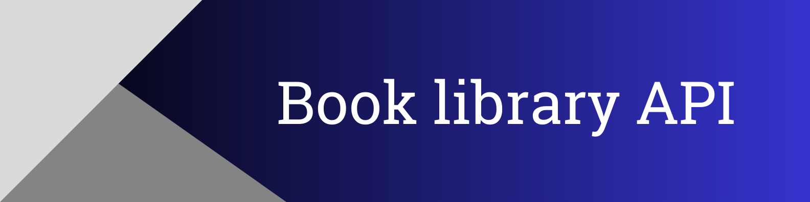

_API for managing books in the library._

## Project modules

<a href='https://pypi.org/project/Django'></a> <a href='https://pypi.org/project/django-filter'></a> <a href='https://pypi.org/project/djangorestframework'></a> <a href='https://pypi.org/project/drf-spectacular'></a> <a href='https://pypi.org/project/psycopg2-binary'></a> <a href='https://pypi.org/project/python-dotenv'></a> 

## Features

- **Book Management**:
  - **Create, Update, Delete**: Manage books with essential details like title, author, ISBN, and language.
  - **View and List**: Retrieve book details by ID and list books with filtering options.

- **Filtering**:
  - Filter books by author, publication year, and language.

- **Pagination**:
  - Display up to 10 books per page.

## Technology Stack

The project utilizes the following technologies and tools:

**Backend**:
- **Python** programming language (OOP);
- **Django** framework for building the application;
    - **Django REST Framework** for creating RESTful APIs;
    - **django-filter** for advanced filtering capabilities;
    - **drf-spectacular** for generating API documentation;
- **PostgreSQL** database (Django ORM);
- **python-dotenv** for managing environment variables.

**Version Control**:
- **Git** for version control and collaboration.

## Environment Variables

To run this project, you will need to add the following environment variables:

`SECRET_KEY`
`DB_HOST` `DB_NAME` `DB_USER` `DB_PASSWORD`

> Look at the .env.sample

## Getting Started

To get started with the project, follow these steps:

1. Clone the repository:
    ```bash
    git clone https://github.com/Gubchik123/DrumNCode-test-task.git
    ```

2. Go to the project directory:

    ```bash
    cd DrumNCode-test-task
    ```

3. Install the required dependencies:
    ```bash
    pip install -r requirements.txt
    ```

4. Set up the database connection and configurations according to the selected database engine. Apply migrations
    ```bash
    python manage.py migrate
    ```

5. Load the initial data into the database:
    ```bash
    python manage.py loaddata books
    ```

6. Run the Django development server:
    ```bash
    python manage.py runserver
    ```

    > **Note:** Don't forget about environment variables

7. Access the API Swagger documentation at:
    ```
    http://127.0.0.1:8000/api/v1/schema/swagger/
    ```

### Testing

To run the tests, run the following command:

```bash
python manage.py test
```
